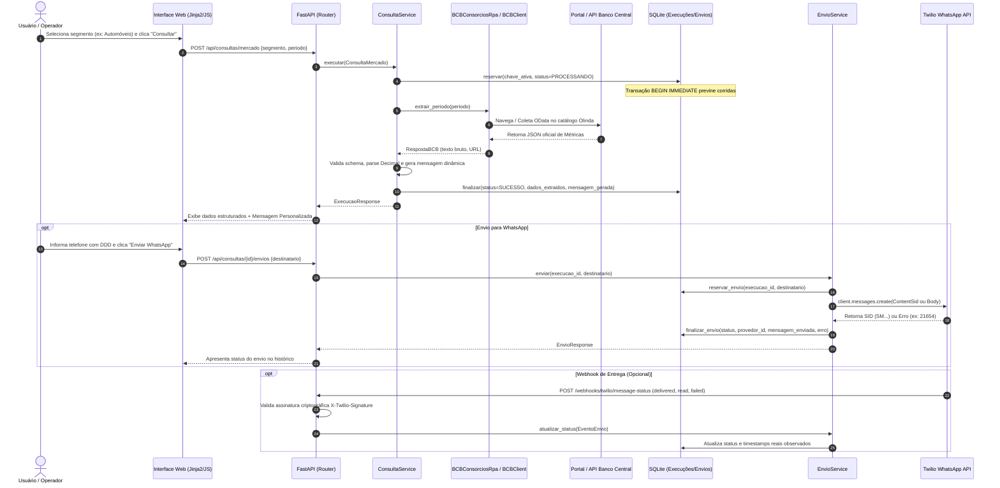

# RPA Consórcios — Consulta Pública BCB & Envio WhatsApp

> Sistema RPA desenvolvido como solução para Desafio Técnico de **Desenvolvedor Full Stack Júnior**.  
> O projeto automatiza a consulta a dados públicos de consórcios no Banco Central do Brasil (BCB), estrutura e valida as informações, gera mensagens dinâmicas personalizadas, despacha notificações via WhatsApp (Twilio) e garante rastreabilidade com histórico auditável e proteção contra duplicidade.

---

## Sumário

- [Sobre o Projeto](#sobre-o-projeto)
- [Fluxo da Aplicação](#fluxo-da-aplicação)
- [Funcionalidades](#funcionalidades)
- [Tecnologias Utilizadas](#tecnologias-utilizadas)
- [Arquitetura e Boas Práticas](#arquitetura-e-boas-práticas)
- [Estrutura do Projeto](#estrutura-do-projeto)
- [Como Executar](#como-executar)
- [Configuração (.env)](#configuração-env)
- [Endpoints da API](#endpoints-da-api)
- [Fonte de Dados Pública e Automação RPA](#fonte-de-dados-pública-e-automação-rpa)
- [Integração com WhatsApp e Ambiente Twilio](#integração-com-whatsapp-e-ambiente-twilio)
- [Persistência, Concorrência e Idempotência](#persistência-concorrência-e-idempotência)
- [Testes Automatizados](#testes-automatizados)

---

## Sobre o Projeto

O desafio propõe a construção de um fluxo ponta a ponta que conecta automação de consulta pública, regras de negócio e entrega de mensageria:

1. **Problema que resolve:** A extração manual de panoramas oficiais de consórcios no portal do Banco Central é lenta e sujeita a erros operacionais. O sistema automatiza a coleta de métricas (cotas ativas, crédito médio, prazo médio, taxas de administração e contemplações), formata os indicadores de maneira compreensível e permite enviá-los imediatamente ao WhatsApp do interessado.
2. **Objetivo do desafio:** Demonstrar competências práticas em Python, automação de navegador (Playwright), APIs assíncronas (FastAPI), validação robusta de fronteira (Pydantic), persistência transacional (SQLAlchemy/SQLite), consumo de APIs externas (Twilio), interfaces reativas leves (Jinja2/Bootstrap/Vanilla JS) e testes automatizados orientados a falhas e idempotência.
3. **Fluxo automatizado:**
   $$\text{Interface Web} \longrightarrow \text{FastAPI} \longrightarrow \text{RPA / BCB} \longrightarrow \text{Validação} \longrightarrow \text{Histórico} \longrightarrow \text{Geração da Mensagem} \longrightarrow \text{Twilio WhatsApp} \longrightarrow \text{Tracking}$$

---

## Fluxo da Aplicação



---

## Funcionalidades

- [x] **Automação RPA no Banco Central:** Navegação automatizada no Portal de Dados Abertos do BCB / Olinda via Playwright (Chromium) com tratamento de paginação, loaders e seletores resilientes.
- [x] **Coleta de Alto Desempenho (Fallback/Híbrido):** Adaptador HTTP oficial via `httpx.AsyncClient` consumindo o catálogo OData documentado, mantendo paridade de contrato com o RPA.
- [x] **Descoberta Dinâmica de Período:** Caso o usuário não especifique o período, a aplicação retrocede trimestralmente até encontrar a última publicação oficial válida para o segmento.
- [x] **Tratamento de Consulta Sem Resultado:** Distinção explícita entre indisponibilidade do BCB e períodos sem publicação oficial (`SEM_RESULTADO`).
- [x] **Validação e Normalização de Dados:** Sanitização e cálculo com precisão monetária e percentual via `Decimal` e validação estrita com Pydantic.
- [x] **Geração Automática da Mensagem:** Criação de texto dinâmico claro e pronto para envio, incluindo cabeçalho, indicadores de mercado e fonte oficial.
- [x] **Envio via WhatsApp:** Integração oficial com SDK Twilio em modo assíncrono.
- [x] **Compatibilidade com "Try out WhatsApp" da Twilio:** Suporte inteligente à limitação de sandbox da Twilio com `ContentSid`, separando a mensagem gerada pelo RPA da mensagem/template despachado.
- [x] **Pronto para Produção:** Alternância imediata para WhatsApp Sender comercial de produção via variável de ambiente (`TWILIO_PRODUCTION_SENDER=true`), enviando texto livre (`body`) sem alterar código.
- [x] **Controle de Duplicidade e Idempotência:** Bloqueio de consultas idênticas concorrentes e rejeição de disparos duplicados para a mesma execução via travas de banco de dados (`BEGIN IMMEDIATE`).
- [x] **Histórico Auditável e Não-Destrutivo:** Registro permanente das consultas e tentativas de envio. Falhas no WhatsApp jamais apagam ou invalidam uma consulta bem-sucedida.
- [x] **Webhooks de Status com Validação Criptográfica:** Endpoint dedicado para receber atualizações de entrega (`sent`, `delivered`, `read`) com validação via `X-Twilio-Signature`.
- [x] **Interface Web Amigável:** Formulário reativo com Bootstrap 5, validação dinâmica de número internacional de telefone e atualização em tempo real.

---

## Tecnologias Utilizadas

| Tecnologia | Responsabilidade no Projeto |
|---|---|
| **Python 3.12+** | Linguagem principal, tipagem estática e async/await nativo. |
| **FastAPI** | Framework web assíncrono de alta performance para rotas e APIs REST. |
| **Uvicorn** | Servidor ASGI para hospedar a aplicação FastAPI. |
| **Playwright** | Automação e emulação do navegador Chromium para scraping do portal do BCB. |
| **Pydantic (v2)** | Schemas de validação de entrada, serialização de respostas e parsing de contratos. |
| **SQLAlchemy (v2)** | ORM e query builder para persistência transacional com SQLite. |
| **SQLite** | Banco de dados relacional embutido com suporte a transações ACID imediatas. |
| **httpx** | Cliente HTTP assíncrono para integração com o catálogo OData do BCB. |
| **Twilio SDK** | SDK oficial assíncrono (`twilio.rest.Client`) para comunicação com WhatsApp. |
| **Jinja2** | Motor de templates para renderização do front-end integrado. |
| **Bootstrap 5** | Estilização da interface, responsividade e componentes acessíveis. |
| **Vanilla JavaScript** | Lógica de interface: máscaras de telefone, requisições AJAX e polling de histórico. |
| **python-dotenv** | Leitura segura de configurações a partir do arquivo `.env`. |
| **pytest & pytest-asyncio** | Testes automatizados unitários e de integração de ponta a ponta. |

---

## Arquitetura e Boas Práticas

O projeto foi estruturado seguindo os princípios de **Clean Architecture**, **SOLID** e separação em camadas, garantindo baixo acoplamento e alta testabilidade:

```text
┌──────────────────────────────────────────────────────────┐
│                      APRESENTAÇÃO                        │
│   FastAPI Routers | Schemas Pydantic | Jinja2 Templates  │
└────────────────────────────┬─────────────────────────────┘
                             │
                             ▼
┌──────────────────────────────────────────────────────────┐
│                        APLICAÇÃO                         │
│     ConsultaService | EnvioService | MensagemService     │
│                 Ports / Interfaces (Protocol)            │
└──────────────┬────────────────────────────┬──────────────┘
               │                            │
               ▼                            ▼
┌───────────────────────────┐  ┌───────────────────────────┐
│          DOMÍNIO          │  │       INFRAESTRUTURA      │
│  Entidades | Enums        │  │  Playwright (RPA)         │
│  Regras | Exceções        │  │  SQLAlchemy Repositories  │
│  (Zero dependências ext.) │  │  Twilio WhatsApp Client   │
└───────────────────────────┘  │  httpx BCB Client         │
                               └───────────────────────────┘
```

- **Domain:** Modelos puros (`Execucao`, `Envio`, `ConsultaMercado`), enums (`Status`, `StatusEnvio`) e exceções de domínio (`ConsultaError`, `EnvioError`). Não importa FastAPI, Playwright ou SQLAlchemy.
- **Application:** Use cases que orquestram os fluxos (`ConsultaService`, `EnvioService`). Dependem exclusivamente de interfaces (`ports.py`), aplicando o Princípio da Inversão de Dependência (DIP).
- **Infrastructure:** Implementa as portas para comunicação com o mundo externo: automação web com Playwright (`BCBConsorciosRpa`), APIs externas (`BCBClient`, `WhatsAppClient`) e repositórios SQLite (`SQLiteExecutionRepository`, `SQLiteEnvioRepository`).
- **Presentation:** Rotas magras em FastAPI que recebem requisições, validam parâmetros com Pydantic, delegam ao caso de uso e mapeiam a resposta ou erro.

---

## Estrutura do Projeto

```text
RPA_Consorcios/
├── .env.example                     # Modelo documentado de variáveis de ambiente
├── requirements.txt                 # Dependências diretas do projeto
├── README.md                        # Documentação do sistema
├── AGENTS.md                        # Regras arquiteturais e convenções de engenharia
├── app/
│   ├── __init__.py
│   ├── main.py                      # Composition Root e inicialização do FastAPI
│   ├── domain.py                    # Entidades, Enums e Exceções puras de negócio
│   ├── api/                         # Camada de apresentação (Web / Rotas)
│   │   ├── __init__.py
│   │   └── routes/
│   │       ├── consulta.py          # Endpoints de consulta e disparo de mensagens
│   │       └── twilio_webhook.py    # Webhook de atualização de status do WhatsApp
│   ├── automation/                  # Automação de Navegador (RPA)
│   │   ├── __init__.py
│   │   └── bcb_consorcios.py        # Coletor Playwright (Chromium) do Banco Central
│   ├── core/                        # Configurações globais
│   │   ├── __init__.py
│   │   └── config.py                # Settings validadas com python-dotenv
│   ├── integrations/                # Adaptadores de comunicação externa
│   │   ├── __init__.py
│   │   ├── bcb_client.py            # Cliente OData via httpx
│   │   └── whatsapp_client.py       # Adaptador assíncrono oficial Twilio WhatsApp
│   ├── models/                      # Modelos ORM (SQLAlchemy)
│   │   ├── __init__.py
│   │   ├── execucao.py              # Tabela 'execucoes'
│   │   └── envio.py                 # Tabela 'envios'
│   ├── repositories/                # Persistência de dados
│   │   ├── __init__.py
│   │   ├── execucao_repository.py   # Repositório de execuções com travas imediatas
│   │   └── envio_repository.py      # Repositório de envios e rastreabilidade
│   ├── schemas/                     # Contratos de API e DTOs (Pydantic)
│   │   ├── __init__.py
│   │   ├── consorcios.py            # DTOs de segmentos de consórcios
│   │   ├── consulta.py              # Request/Response de execuções
│   │   └── envio.py                 # Request/Response de envios
│   ├── services/                    # Regras de aplicação e casos de uso
│   │   ├── __init__.py
│   │   ├── ports.py                 # Interfaces e Protocols das portas
│   │   ├── bcb_service.py           # Parser da métrica 10
│   │   ├── bcb_mercado_service.py   # Parser e orquestrador do panorama completo
│   │   ├── consulta_service.py      # Caso de uso: consulta e histórico
│   │   ├── envio_service.py         # Caso de uso: envio WhatsApp e rastreamento
│   │   ├── mensagem_service.py      # Formatador de mensagens em texto puro
│   │   └── mensagem_automoveis.py   # Estrutura textual padronizada
│   ├── static/                      # Arquivos estáticos front-end
│   │   └── consulta.js              # Interações e validações de interface
│   └── templates/                   # Visualização (Jinja2)
│       └── consulta.html            # Página única de consulta e disparo
├── data/                            # Diretório local do banco SQLite
│   └── consultas.sqlite3
├── docs/                            # Documentações adicionais de apoio
│   ├── ARQUITETURA_CAMADAS.md
│   └── CONSULTA_BCB.md
└── tests/                           # Testes automatizados (pytest)
    ├── conftest.py                  # Fixtures globais e mocks seguros
    ├── unit/                        # Testes unitários (RPA, domínio, WhatsApp, etc.)
    │   ├── test_mercado.py
    │   ├── test_normalizacao.py
    │   ├── test_rpa.py
    │   └── test_whatsapp.py
    └── integration/                 # Testes de integração e rotas HTTP
        ├── test_browser.py          # Testes de interface via Playwright
        ├── test_consultas.py        # Fluxo de consultas no banco
        ├── test_http_envio.py       # Fluxo ponta a ponta de consulta e envio
        └── test_live_bcb.py         # Teste opcional contra o BCB real
```

---

## Como Executar

### Pré-requisitos
- **Python 3.12+** instalado.
- Conexão com a internet para baixar dependências e consultar a fonte pública.

### 1. Clonar e preparar o ambiente virtual
```powershell
git clone https://github.com/seu-usuario/RPA_Consorcios.git
cd RPA_Consorcios

python -m venv .venv
# No Windows PowerShell:
.venv\Scripts\Activate.ps1
# No Linux/macOS:
# source .venv/bin/activate

python -m pip install --upgrade pip
python -m pip install -r requirements.txt
```

### 2. Instalar navegadores do Playwright (para o RPA)
```powershell
python -m playwright install chromium
```

### 3. Configurar variáveis de ambiente
Crie o arquivo `.env` na raiz a partir do `.env.example`:
```powershell
Copy-Item .env.example .env
```
*(Consulte a seção seguinte para os parâmetros Twilio)*

### 4. Inicializar a aplicação
```powershell
python -m uvicorn app.main:app --host 127.0.0.1 --port 8000
```
Acesse a aplicação no navegador em: **`http://127.0.0.1:8000`**

---

## Configuração (.env)

As variáveis de ambiente configuram o comportamento dos serviços:

| Variável | Padrão | Descrição |
|---|---|---|
| `DATABASE_PATH` | `data/consultas.sqlite3` | Caminho do arquivo de banco SQLite. Criado automaticamente se não existir. |
| `BROWSER_TIMEOUT_MS` | `30000` | Timeout do Playwright em milissegundos. |
| `QUERY_TIMEOUT_SECONDS` | `120` | Timeout total do caso de uso de consulta. |
| `DUPLICATE_SECONDS` | `30` | Janela de idempotência: repetições em menos de 30s reutilizam a consulta existente. |
| `BROWSER_HEADLESS` | `true` | Se `true`, executa o Chromium sem abrir janela gráfica. |
| `HTTP_TIMEOUT_SECONDS` | `30` | Timeout para chamadas HTTP externas (BCB e Twilio). |
| `TWILIO_ACCOUNT_SID` | *(vazio)* | Account SID da sua conta Twilio (`AC...`). |
| `TWILIO_AUTH_TOKEN` | *(vazio)* | Auth Token da sua conta Twilio. |
| `TWILIO_WHATSAPP_FROM` | *(vazio)* | Número remetente do WhatsApp (ex: `whatsapp:+17372508034`). |
| `TWILIO_WHATSAPP_TO` | *(vazio)* | Número padrão opcional para auto-preenchimento na interface. |
| `TWILIO_CONTENT_SID` | *(vazio)* | Content SID de template aprovado no ambiente **Try out WhatsApp** (ex: `HXfe5ab5...`). |
| `TWILIO_PRODUCTION_SENDER` | `false` | Se `true`, opera em modo produção comercial (envia corpo livre `body` da mensagem gerada). |
| `TWILIO_PANORAMA_CONTENT_SID` | *(vazio)* | Content SID alternativo para template específico com variáveis dos consórcios. |
| `TWILIO_STATUS_CALLBACK_URL` | *(vazio)* | URL pública HTTPS para webhooks de status (ex: `https://seu-subdominio.ngrok-free.app/webhooks/twilio/message-status`). |
| `TWILIO_VALIDATE_SIGNATURE` | `true` | Valida assinatura criptográfica dos webhooks da Twilio. |

---

## Endpoints da API

### Interface Web
- **`GET /`**: Renderiza a aplicação interativa via Jinja2 (`consulta.html`).

### Consultas Públicas
- **`POST /api/consultas/mercado`**: Executa a consulta completa de panorama de consórcios por segmento.
  - **Body (JSON):**
    ```json
    {
      "segmento": "Automóveis",
      "periodo": "2026-06"
    }
    ```
    *(Nota: `periodo` é opcional. Se omitido, a aplicação busca o trimestre mais recente com dados).*
- **`POST /api/consultas`**: Consulta pontual da métrica agregada total (compatibilidade).
- **`GET /api/consultas`**: Lista as últimas 20 consultas gravadas no histórico.
- **`GET /api/consultas/{id}`**: Obtém os detalhes completos de uma execução específica.

### Envio de WhatsApp
- **`POST /api/consultas/{id}/envios`**: Dispara o envio da mensagem gerada para o telefone fornecido.
  - **Body (JSON):**
    ```json
    {
      "destinatario": "8694423074"
    }
    ```
    *(O backend normaliza automaticamente para formato internacional `+558694423074`).*
- **`GET /api/consultas/{id}/envios`**: Lista as tentativas de envio e estados associados a uma consulta.

### Webhook do Provedor
- **`POST /webhooks/twilio/message-status`**: Endpoint que recebe callbacks assíncronos da Twilio com status de envio (`sent`, `delivered`, `read`, `failed`).

---

## Fonte de Dados Pública e Automação RPA

- **Origem dos Dados:** [Banco Central do Brasil — Dados Agregados do Segmento de Consórcios](https://dadosabertos.bcb.gov.br/dataset/dados-agregados-do-segmento-de-consorcios), catálogo oficial Olinda/OData.
- **Segmentos Disponíveis:** Automóveis, Imóveis, Veículos Pesados, Motocicletas, Outros bens móveis duráveis, Serviços e Mercado Total, além de detalhamentos de veículos pesados (caminhões, ônibus, máquinas agrícolas).
- **Indicadores Extraídos:** Cotas ativas, Crédito médio comercializado, Prazo médio dos grupos, Taxa média de administração e Cotas contempladas nos últimos 12 meses.
- **Estratégia RPA (Playwright):** O componente `BCBConsorciosRpa` acessa o navegador de dados, interage com os parâmetros da página, aguarda loaders de carregamento desaparecerem e extrai o payload diretamente do DOM renderizado, tratando erros de catálogo e indisponibilidades.

---

## Integração com WhatsApp e Ambiente Twilio

### Limitações do Sandbox ("Try out WhatsApp")
Nas contas gratuitas/trial da Twilio, o fluxo **Try out WhatsApp** possui restrições de conformidade:
1. **Rejeição de Mensagens com Corpo Livre (`body`)**: Disparos com texto arbitrário retornam o erro HTTP 400: `21654: ContentSid Required`.
2. **Templates Pré-Aprovados**: O ambiente de teste aceita exclusivamente o envio de templates cadastrados utilizando o parâmetro `content_sid`.

### Solução Arquitetural Adotada
O sistema foi desenhado para contornar essa restrição mantendo total separação de responsabilidades:
- **Preservação da Mensagem do RPA:** A mensagem personalizada completa com todos os dados econômicos da consulta é **sempre gerada**, armazenada no banco (`execucoes.dados_extraidos._mensagem_gerada`), apresentada na tela e guardada em `envios.mensagem`.
- **Separação entre Mensagem Gerada e Mensagem Enviada:**
  - `envios.mensagem`: Contém a mensagem rica e dinâmica gerada pelo RPA.
  - `envios.mensagem_enviada`: Identifica o template efetivamente disparado (`[Template Twilio Content SID: ...]`) no ambiente de demonstração, ou o texto integral em produção.
- **Tratamento do Erro 21654:** Caso a Twilio rejeite o envio, o erro é interceptado, registrado no histórico como `FALHOU` com o código `21654`, e apresentado na interface de forma clara e amigável:
  > *"Consulta realizada e mensagem gerada com sucesso."*  
  > *"Não foi possível realizar o envio pelo WhatsApp: O ambiente de demonstração da Twilio (Try out WhatsApp) está limitado aos templates de teste permitidos (ContentSid)."*
- **Integridade da Consulta:** Uma falha na entrega do WhatsApp **jamais invalida a consulta**, que permanece gravada como `SUCESSO`.

### Transição para Produção
Para colocar o sistema em produção com um número oficial comercial do WhatsApp:
1. Configure no `.env`:
   ```ini
   TWILIO_PRODUCTION_SENDER=true
   TWILIO_CONTENT_SID=
   ```
2. O sistema passará a despachar a mensagem personalizada integral diretamente via parâmetro `body`, **sem exigir qualquer alteração no RPA ou nas regras de negócio**.

---

## Persistência, Concorrência e Idempotência

O repositório em SQLite foi implementado com foco em resiliência e concorrência:
- **Reserva Imediata:** Ao iniciar a consulta, a aplicação grava preventivamente a execução com status `PROCESSANDO` e uma `chave_ativa` única calculada a partir dos parâmetros.
- **Transação `BEGIN IMMEDIATE`:** Bloqueia leituras sujas e condições de corrida entre requisições simultâneas.
- **Proteção de Idempotência:** Requisições idênticas recebidas durante o processamento ou em até 30 segundos após a conclusão retornam o registro existente marcado como `DUPLICADA`, sem disparar novas chamadas ao BCB.
- **Unicidade de Disparo:** A tabela `envios` possui restrição única `(execucao_id, destinatario)`, garantindo que cliques repetidos ou problemas de rede não causem múltiplos envios acidentais para o mesmo cliente.

---

## Testes Automatizados

O projeto conta com suíte de testes cobrindo testes unitários e de integração com **100% de sucesso**:

```text
tests/
├── unit/
│   ├── test_mercado.py        # Parsing de indicadores e regras de cálculo do BCB
│   ├── test_normalizacao.py    # Formatação e validação de números de telefone
│   ├── test_rpa.py             # Tratamento de DOM e timeouts do coletor
│   └── test_whatsapp.py        # Modos Demo (ContentSid), Produção (Body) e erro 21654
└── integration/
    ├── test_consultas.py       # Ciclo de vida e idempotência no banco SQLite
    ├── test_http_envio.py      # Fluxo completo de consulta pública, envio e webhook
    ├── test_browser.py         # Testes ponta a ponta de interface com Playwright
    └── test_live_bcb.py        # Testes de integração direta contra o Banco Central
```

### Executar a suíte de testes

```powershell
# Execução padrão dos testes unitários e de integração com isolamento de banco:
python -m pytest --basetemp=data/pytest_temp -p no:cacheprovider

# Apenas testes unitários:
python -m pytest tests/unit

# Apenas testes de integração:
python -m pytest tests/integration/test_http_envio.py --basetemp=data/pytest_temp -p no:cacheprovider

# Verificação de compilação:
python -m compileall app tests
```

---

## Autor

Desenvolvido por **Matheus** no âmbito do Desafio Técnico para Desenvolvedor Full Stack Júnior.
